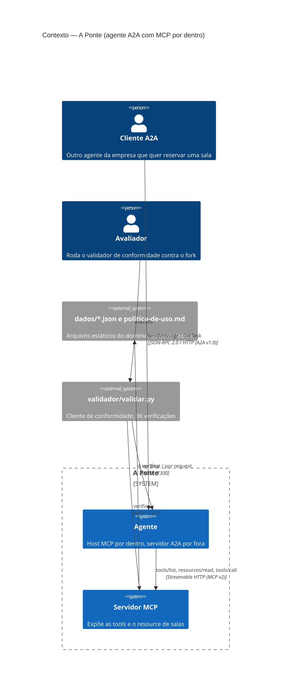
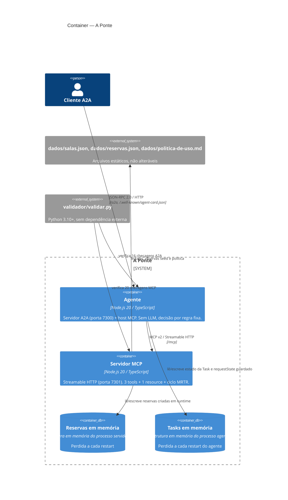
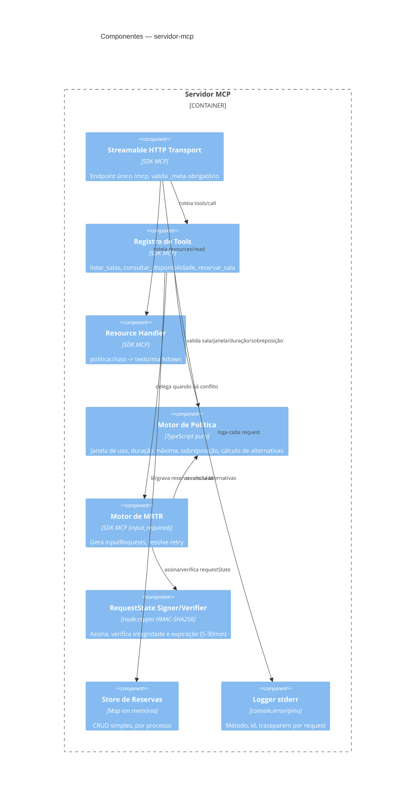
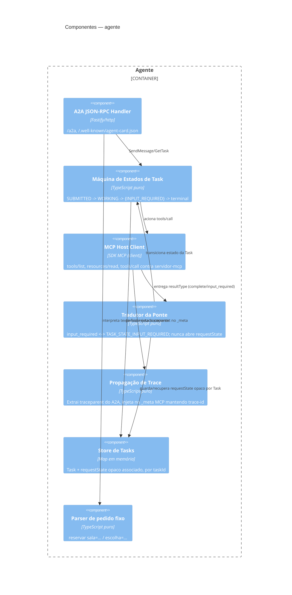

# Arquitetura — Modelo C4

**Documento:** 02-architecture.md
**Depende de:** [01-pontea2a.prd.md](./01-pontea2a.prd.md)
**Detalhamento técnico:** [04-specs.md](./04-specs.md), [05-contract.md](./05-contract.md)

Este documento cobre os três primeiros níveis do modelo C4 (Contexto, Container, Componente). O nível 4 (Código) não se aplica — o domínio é deliberadamente pequeno (5 salas, 3 regras) e o código-fonte é a própria documentação de nível 4.

## 1. Nível 1 — Contexto (System Context)

**Leitura**: de fora, "A Ponte" é opaca — um cliente A2A não sabe (nem precisa saber) que por trás da skill `reservar-sala` existe um agente que por sua vez fala com um servidor MCP. Essa opacidade é requisito de produto (ver [01-pontea2a.prd.md §20](./01-pontea2a.prd.md#20-as-três-fricções-propositais-riscos-de-execução-conhecidos)).

## 2. Nível 2 — Container

**Observações de fronteira:**
- `agente` e `mcpServer` são processos independentes; a única via de comunicação entre eles é HTTP real (Streamable HTTP), nunca chamada de função direta.
- O `requestState` emitido pelo `mcpServer` precisa sobreviver a um restart do próprio `mcpServer` — por isso ele **não** é guardado em `memReservas`, e sim serializado, assinado e devolvido ao cliente (o agente), que o guarda associado à Task em `memTasks` sem nunca abri-lo.

## 3. Nível 3 — Componente

### 3.1 Componentes do `servidor-mcp`

### 3.2 Componentes do `agente`

## 4. Decisões de arquitetura derivadas

As decisões que sustentam este desenho (por que HMAC e não apenas base64, por que dois processos, por que sem callback síncrono) estão registradas formalmente em [03-adr.md](./03-adr.md).

## 5. Fora de escopo arquitetural

Sem gateway, sem service mesh, sem banco de dados, sem fila de mensagens, sem container/orquestração — ver [01-pontea2a.prd.md §22](./01-pontea2a.prd.md#22-fora-de-escopo).
